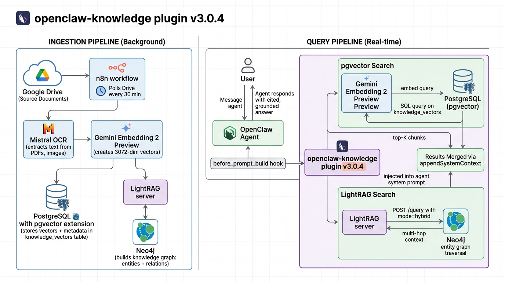
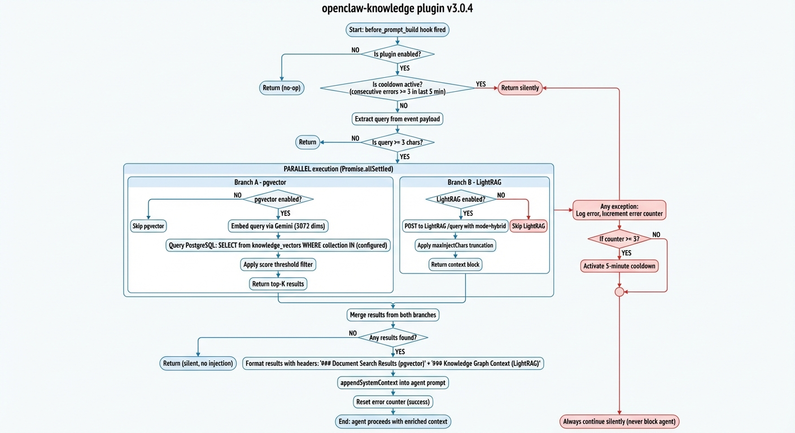
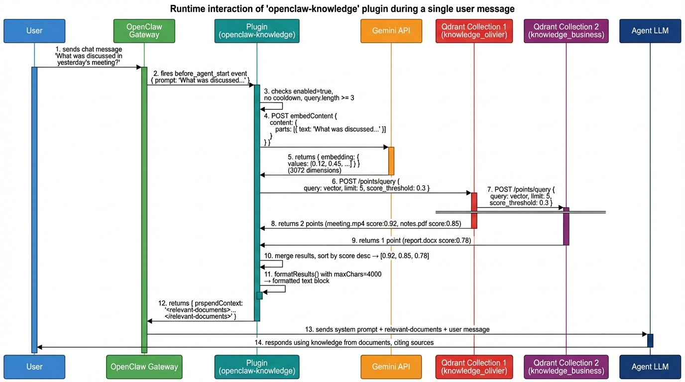
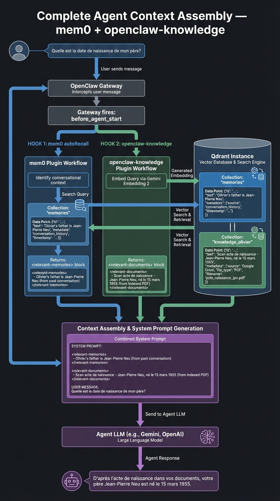

# openclaw-knowledge-plugin

Multi-collection Qdrant knowledge search plugin for OpenClaw — automatic RAG injection with Gemini Embedding 2.

## What it does

This plugin hooks into OpenClaw's `before_agent_start` lifecycle event to **automatically** search your Qdrant knowledge collections before every agent turn. Results are injected into the agent's context via `prependContext`, so the agent always has access to relevant documents without the user needing to ask for it.

This is **deterministic** — unlike skills, the search runs on every message, not when the LLM decides to use it.

## System architecture

The plugin sits between the OpenClaw gateway and two external services: the Gemini Embedding API for vectorizing queries and Qdrant for similarity search. Documents are ingested separately by an n8n ETL pipeline that polls Google Drive, embeds content via Gemini multimodal, and stores vectors in Qdrant.



The query embedding uses the same model (`gemini-embedding-2-preview`, 3072 dimensions) as the document ingestion pipeline, ensuring cross-modal compatibility: a text query finds documents embedded as multimodal content (PDFs, images, audio, video).

## How it works

Every time a user sends a message, the `before_agent_start` hook fires and runs through a series of guards and processing steps. The flowchart below shows the complete decision path, including the error handling and cooldown mechanism.



**Key safeguards:**
- The plugin **never blocks the agent** — all errors are caught silently.
- After **3 consecutive failures**, the plugin enters a **5-minute cooldown** to avoid log spam and unnecessary API calls.
- Queries shorter than 3 characters are skipped to avoid meaningless searches.

## Runtime sequence

The following diagram shows the precise interaction between all components for a single user message. Note how the Qdrant collections are searched **in parallel** to minimize latency.



**Step-by-step breakdown:**
1. The user sends a message (e.g. "What was discussed in yesterday's meeting?").
2. The gateway fires the `before_agent_start` event with the user's prompt.
3. The plugin calls Gemini to embed the query into a 3072-dimension vector.
4. The vector is sent to all configured Qdrant collections simultaneously.
5. Results from all collections are merged and sorted by similarity score (best first).
6. The top results are formatted (respecting the `maxInjectChars` limit) and wrapped in a `<relevant-documents>` block.
7. This block is injected into the agent's prompt via `prependContext`, so the LLM can cite and use the documents in its response.

## Features

- **Multi-collection search** — query multiple Qdrant collections in parallel
- **Deterministic** — runs on every message via `before_agent_start` hook
- **Cross-modal compatible** — text queries find multimodal documents (same embedding space)
- **Coexists with mem0** — no slot conflict, complements conversational memory
- **Zero dependencies** — uses Node.js native `fetch`
- **Fail-safe** — errors are silently caught, never blocks the agent
- **Cooldown** — pauses 5 min after 3 consecutive errors to avoid log spam
- **Configurable** — score threshold, top-K, max injection size, per-instance collections

## Installation

### Option 1: From GitHub Release (recommended)

Download the latest tarball from [GitHub Releases](https://github.com/OlivierNeu/openclaw-knowledge-plugin/releases), then extract it into the OpenClaw extensions directory:

```bash
# Download the release artifact
wget https://github.com/OlivierNeu/openclaw-knowledge-plugin/releases/download/v1.0.0/openclaw-knowledge-1.0.0.tar.gz

# Extract into OpenClaw extensions
tar -xzf openclaw-knowledge-1.0.0.tar.gz -C /path/to/.openclaw/extensions/

# Verify
ls /path/to/.openclaw/extensions/openclaw-knowledge/
# → index.js  LICENSE  openclaw.plugin.json  package.json
```

### Option 2: From source (development)

```bash
git clone https://github.com/OlivierNeu/openclaw-knowledge-plugin.git
cp -r openclaw-knowledge-plugin /path/to/.openclaw/extensions/openclaw-knowledge
```

### Configure via CLI

```bash
# Add to plugin allowlist
openclaw config set plugins.allow '["openclaw-mem0", "openclaw-knowledge", "telegram", "whatsapp"]'

# Enable and configure
openclaw config set plugins.entries.openclaw-knowledge.enabled true
openclaw config set plugins.entries.openclaw-knowledge.config.geminiApiKey '${GEMINI_API_KEY}'
openclaw config set plugins.entries.openclaw-knowledge.config.qdrantUrl "http://qdrant:6333"
openclaw config set plugins.entries.openclaw-knowledge.config.qdrantApiKey '${QDRANT_API_KEY}'
openclaw config set plugins.entries.openclaw-knowledge.config.collections '["knowledge_alice"]'
```

### Restart

```bash
openclaw gateway restart
```

### Updating

To update to a new version, download the new tarball and extract it over the existing files:

```bash
wget https://github.com/OlivierNeu/openclaw-knowledge-plugin/releases/download/vX.Y.Z/openclaw-knowledge-X.Y.Z.tar.gz
tar -xzf openclaw-knowledge-X.Y.Z.tar.gz -C /path/to/.openclaw/extensions/
openclaw gateway restart
```

## Configuration

Add to `openclaw.json` under `plugins.entries`:

```json
{
  "openclaw-knowledge": {
    "enabled": true,
    "config": {
      "geminiApiKey": "${GEMINI_API_KEY}",
      "qdrantUrl": "http://qdrant:6333",
      "qdrantApiKey": "${QDRANT_API_KEY}",
      "collections": ["knowledge_alice", "knowledge_shared"],
      "topK": 5,
      "scoreThreshold": 0.3,
      "maxInjectChars": 4000,
      "enabled": true
    }
  }
}
```

### Config reference

| Parameter | Type | Default | Description |
|-----------|------|---------|-------------|
| `geminiApiKey` | string | **required** | Gemini API key (supports `${ENV_VAR}` syntax) |
| `qdrantUrl` | string | `http://qdrant:6333` | Qdrant server URL |
| `qdrantApiKey` | string | — | Qdrant API key (supports `${ENV_VAR}` syntax) |
| `collections` | string[] | `["knowledge_alice"]` | Qdrant collections to search |
| `topK` | number | `5` | Max results per collection |
| `scoreThreshold` | number | `0.3` | Min similarity score (0-1) |
| `maxInjectChars` | number | `4000` | Max characters injected into prompt |
| `enabled` | boolean | `true` | Enable/disable knowledge injection |

## Qdrant collection requirements

Collections must use:
- **Dimensions**: 3072 (Gemini Embedding 2 Preview default)
- **Distance**: Cosine

Expected payload fields per point:

| Field | Type | Description |
|-------|------|-------------|
| `file_name` | string | Source document name |
| `text` | string | Extracted text content (for the agent to read) |
| `mime_type` | string | Document MIME type |
| `file_id` | string | Google Drive file ID |
| `source` | string | Origin (e.g. `google_drive`) |
| `owner` | string | Document owner |
| `chunk_index` | number | Chunk index (for split documents) |
| `total_chunks` | number | Total chunks in document |
| `timestamp_start` | string | Start time (video/audio segments) |
| `timestamp_end` | string | End time (video/audio segments) |
| `embedded_at` | string | ISO timestamp of indexing |

## Architecture

This plugin is part of a larger knowledge pipeline (see [system architecture diagram](#system-architecture) above for the full picture):

1. **Ingestion (background):** n8n polls Google Drive every 30 min → Gemini embeds documents (multimodal, 3072 dims) → vectors + extracted text stored in Qdrant.
2. **Query (real-time):** User message → plugin embeds query (text mode, same model) → parallel Qdrant search → results injected into agent context.

## Relationship with mem0

This plugin **complements** mem0, it does not replace it:

| | mem0 | openclaw-knowledge |
|---|------|-------------------|
| Purpose | Conversational memory | Document knowledge (RAG) |
| Collection | `memories` | `knowledge_*` (multiple) |
| Source | Facts extracted from chats | Documents from Google Drive |
| Embedding | Text (facts extracted by LLM) | Multimodal (raw PDF/image/video binary) |
| Trigger | `autoRecall` (automatic) | `before_agent_start` (automatic) |
| Injection | `<relevant-memories>` block | `<relevant-documents>` block |
| Slot | `memory` (exclusive) | None (coexists freely) |
| Governance | User can store/forget/query facts | Driven by indexed folder content |

Both hooks fire automatically on every message. The agent receives **both** context blocks in its system prompt, giving it access to conversational memory AND document knowledge simultaneously.

### How the combined prompt looks

```
<relevant-memories>
- User's preferred document style: formal, structured, premium quality
- Standard consulting daily rate is 1500 EUR
</relevant-memories>

<relevant-documents>
[knowledge_alice] Contrat_Acme_Corp.pdf (score: 0.92)
Content: Service agreement between Alice Consulting and Acme Corp. Duration: 6 months...
</relevant-documents>

User: What were the terms of the Acme contract?
```

The LLM can then cross-reference both sources to give an accurate, cited answer.

### Context assembly diagram

The following diagram shows how both plugins work together during a single user message, from the initial question through parallel search in both memory and documents, to the final assembled prompt:



### Why two separate plugins instead of one?

| Concern | Answer |
|---------|--------|
| Why not merge into one plugin? | mem0 uses its own LLM pipeline to extract facts — fundamentally different from document vector search. Merging would couple two independent concerns. |
| Why not extend mem0 to search multiple collections? | mem0 OSS doesn't support multi-collection search or metadata filtering. These are Platform-only features (paid). |
| Can they conflict? | No — mem0 uses the `memory` slot, this plugin has no slot. Both `prependContext` blocks are concatenated by the gateway. |
| What if both return the same information? | The LLM handles deduplication naturally. Redundant context reinforces confidence in the answer. |

## Use cases

### Use case 1: Finding information in personal documents

**User**: "What were the terms of the Acme contract?"

1. **mem0 autoRecall** searches `memories` → finds fact: "Acme Corp is a key client, 6-month engagement"
2. **openclaw-knowledge** searches `knowledge_alice` → finds indexed PDF: signed service agreement with full terms
3. **Agent** combines both: "According to the Acme Corp contract in your documents, the engagement is 6 months with a daily rate of 1500 EUR."

Without the knowledge plugin, the agent could only answer if the user had previously mentioned the terms in a conversation. With the plugin, it finds the actual document.

### Use case 2: Reusing work materials

**User**: "Draft a proposal for ClientB using the same format as the ClientA proposal"

1. **mem0** recalls: "User prefers formal, premium-quality document style. Standard daily rate is 1500 EUR."
2. **openclaw-knowledge** finds: the ClientA proposal document with structure, vocabulary, and pricing
3. **Agent** produces a first draft using ClientA's format, the user's vocabulary, and the memorized pricing

### Use case 3: Finding information in video/audio segments

**User**: "In which meeting did we discuss the pilot project?"

1. **openclaw-knowledge** finds: video segment `team-meeting-march.mp4` at 02:00-03:20 with transcription "We decided to launch the pilot project in April"
2. **Agent**: "In the March team meeting, at the 2-minute mark, you discussed launching the pilot project for April."

### Use case 4: Cross-collection search

**User**: "What documents do we have on ClientB?"

With collections `["knowledge_alice", "knowledge_shared"]`:
1. **openclaw-knowledge** searches both collections in parallel
2. Finds: proposal draft in `knowledge_alice`, signed contract in `knowledge_shared`
3. **Agent** lists all matching documents with their sources

## Multi-tenant

Each OpenClaw instance configures its own collection list:

```json
// Alice's instance
"collections": ["knowledge_alice", "knowledge_shared"]

// Bob's instance
"collections": ["knowledge_bob", "knowledge_shared"]

// Carol's instance
"collections": ["knowledge_carol", "knowledge_shared"]
```

## License

MIT
